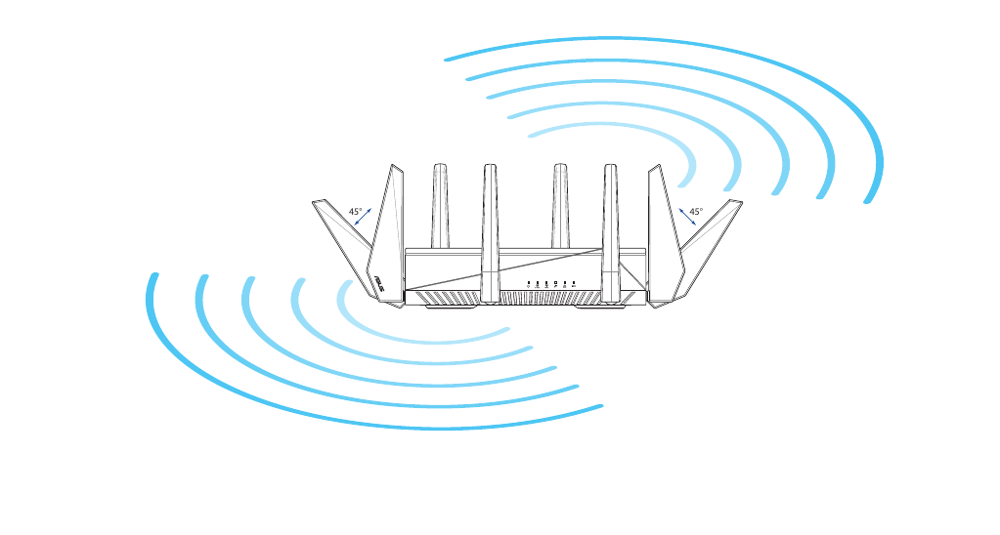

# Placement

How and where to physically place the GT-AC5300 for the best wireless signal. From manual §1.4 "Positioning your router" (manual pages 9–10).

> **One-time decision**: this isn't a GUI setting — it's a physical placement decision you make once when you set up the router. Once positioned well, you should not need to revisit it unless your living situation changes (renovation, moving the router, adding/replacing clients).

## Location

- **Centralized**: place the router in the **center** of the area you want to cover, for maximum coverage to all network devices.
- **Avoid metal obstructions** — they block and reflect 2.4 / 5 GHz signals.
- **Avoid direct sunlight** — the router's plastic enclosure can warp or discolor, and direct sun heats up the internals.

## Avoid these interference sources

The 2.4 GHz band in particular is crowded. Keep the router away from:

- **802.11g** or **20 MHz-only** Wi-Fi devices (legacy clients that pin the radio to a slower mode)
- **2.4 GHz computer peripherals** (some wireless keyboards / mice / headsets / printers)
- **Bluetooth** devices
- **Cordless phones**
- **Transformers** and **heavy-duty motors**
- **Fluorescent lights**
- **Microwave ovens**
- **Refrigerators** and other large appliances with motors/compressors
- **Industrial equipment**

## Antenna orientation

The GT-AC5300 ships with **four detachable antennas**. For best wireless signal, orient them as shown in the manual's drawing (page 10):

- **Two outer antennas at 45°** (one to each side, angled outward).
- **Two inner antennas vertical** (pointing straight up).

All four are 2.4 / 5 GHz dual-band (Reversed-SMA, 2.14 dBi @ 2.4 GHz / 2.98 dBi @ 5 GHz per the IC filing — see the entity page's hardware section).

> Don't tilt the inner antennas outward; the manual's drawing has them vertical. The pattern above assumes typical home use; if you have unusual coverage needs, [[wireless-settings#Professional|Professional]] settings allow TX power adjustment (0–100).

## Firmware

The manual also reminds readers at this point to "**always update to the latest firmware**". Firmware updates often include RF / driver fixes that improve real-world range and throughput. See [[firmware]] for the update procedure and release history.

## When placement isn't enough

If you've positioned the router centrally and oriented the antennas correctly but a specific client still can't connect:

- See [[troubleshooting#Client can't connect wirelessly]] — covers out-of-range, DHCP, SSID-hidden, and channel-mismatch causes.
- Consider a **powerline adapter**, **MoCA**, or **mesh** ([[aimesh]]) extension to reach dead zones rather than moving the router to a non-central location.
- For large homes, the GT-AC5300 supports [[aimesh]] as a controller (newer firmware) — you can add other ASUS routers as nodes to extend coverage without compromising the central placement.
