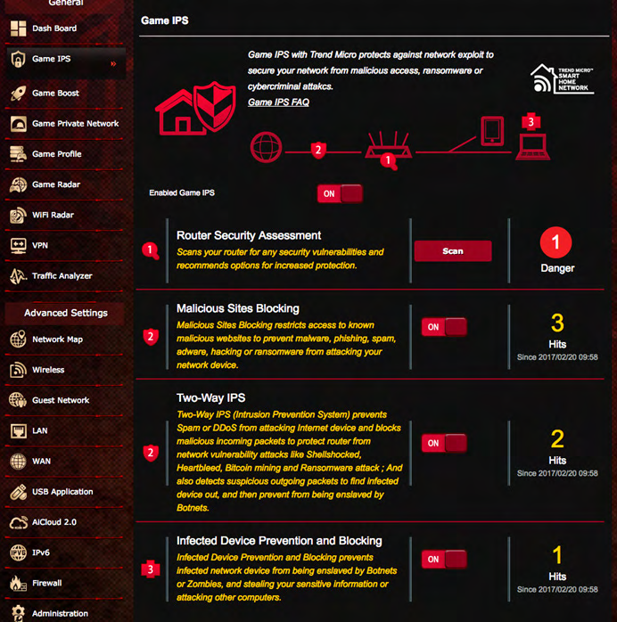
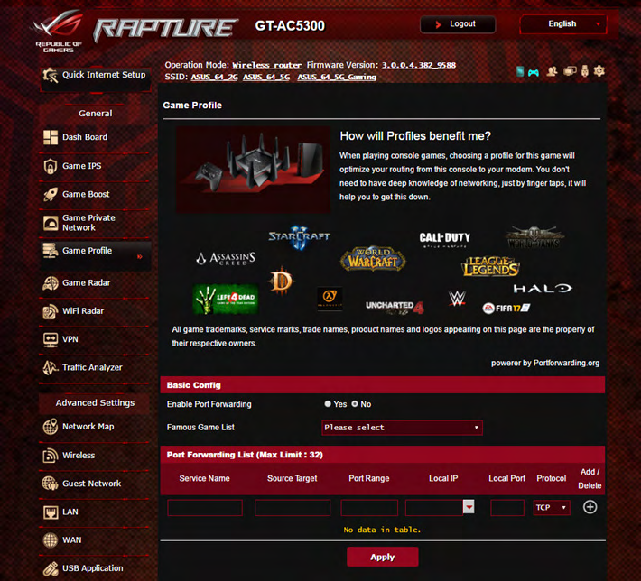
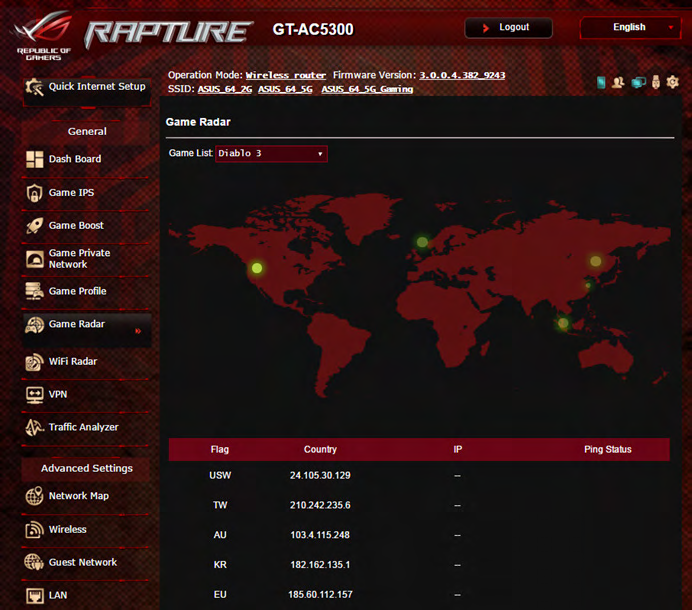
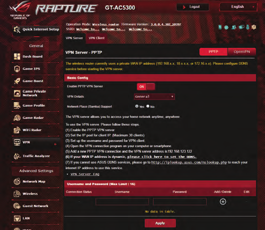
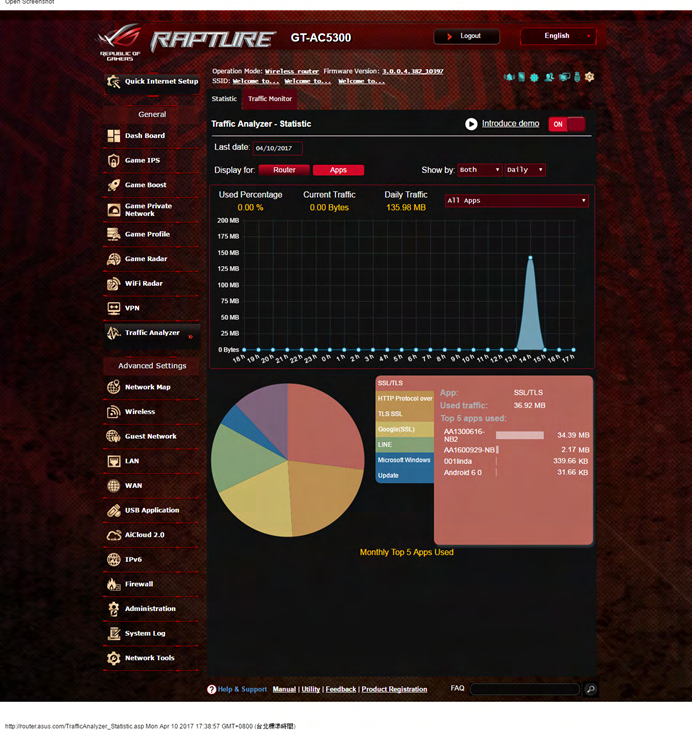
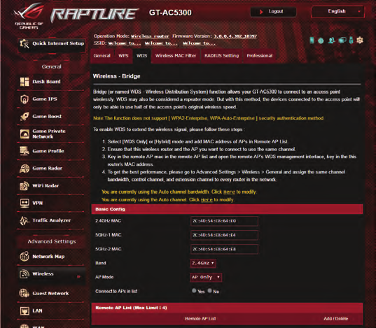
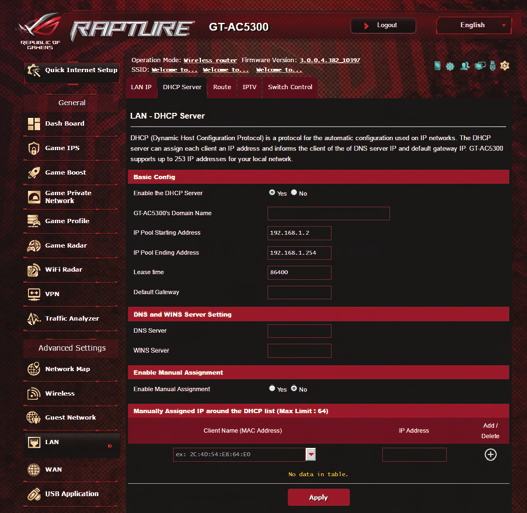

# GT-AC5300 manual — figure catalog (pilot)

A small set of figures extracted from the May-2017 user manual (document E12817). This is a **pilot** to test the assets/ + figure-naming conventions documented in `AGENT.md` before scaling to the remaining ~347 extracted images (mostly icons and small graphics that aren't wiki-worthy).

**Extraction**: `pdfimages -j E12817_GT_AC5300_Manual.pdf` → 369 raw images → 354 PNG conversions (PPM → PNG via PIL) → 11 small JPG icons deleted → 7 substantive figures kept and renamed per the convention `{source-prefix}-p{page}-{index}-{caption}.png`.

## Figures

### Game IPS — overview

Source: manual page 23, figure 128. Shows the Game IPS top-level interface with **Router Security Assessment** (Scan button), **Malicious Sites Blocking**, **Two-Way IPS**, **Infected Device Prevention and Blocking**, and the **Network Protection** / **Parental Controls** tab bar.



Maps to: [[../concepts/game-ips]]

### Game Profile — curated list

Source: manual page 36, figure 149. Shows the Game Profile page with the curated port-forwarding preset logos (StarCraft, Assassin's Creed, Diablo, World of Warcraft, League of Legends, Uncharted, FIFA 17, Halo, etc.) and the per-game Port Forwarding List editor.



Maps to: [[../concepts/game-profile]]

### Game Radar — world map

Source: manual page 38, figure 153. Shows the Game Radar page with the world map and ping markers per server region (USW, TW, AU, KR, EU), plus the per-server ping status table below.



Maps to: [[../concepts/game-radar]]

### VPN Server — PPTP

Source: manual page 43, figure 166. Shows the PPTP VPN Server config screen with the Basic Config (Enable toggle, VPN Details, Network Place support), the step-by-step client setup instructions, and the Username / Password table editor.



Maps to: [[../concepts/vpn]]

### Traffic Analyzer — static

Source: manual page 46, figure 169. Shows the Traffic Analyzer static mode with the daily-traffic line chart, the per-app pie chart (SSL/TLS, HTTP, Google, etc.), and the Monthly Top 5 Apps Used table.



Maps to: (no dedicated concept page yet — Traffic Analyzer is described inline in [[../concepts/game-boost]] and the manual summary [[gt-ac5300-manual]].)

### Wireless — Bridge mode

Source: manual page 55, figure 193. Shows the Wireless → Bridge tab with the 2.4 GHz MAC address entry, AP Mode selector (AP Only), and the "Connect to APs in list" toggle.



Maps to: [[../concepts/wireless-settings]]

### LAN — DHCP Server

Source: manual page 66, figure 220. Shows the LAN → DHCP Server tab with Basic Config (Enable DHCP Server, Domain Name, IP Pool start/end, Lease Time, Default Gateway) and the per-client manual-assignment table.



Maps to: [[../concepts/lan-wan]]

## Naming convention used

```
{prefix}-p{page}-{figure-index}-{caption}.png
```

Examples:

- `manual-p023-128-game-ips-overview.png` — manual, page 23, figure index 128, caption "game-ips-overview"
- `pcmag-p02-15-router-photo.jpg` — (future) PCMag review, page 2, figure 15

Source-prefix values used so far: `manual`. Future prefixes will follow the same pattern (`pcmag`, `firmware-page`, etc.).

## What was filtered out

The extraction produced 369 raw images; 354 were converted to PNG and 11 JPG icons were kept initially but then deleted as too small (<5 KB each, almost certainly toolbar icons). Of the 354 PNGs, 7 were kept as substantively wiki-worthy (those listed above); the other 347 were deleted as either duplicates, decorative background graphics, or icons. Most of those 347 were small (median ~150 KB after PNG compression; many were tiny 1-component indexed icons or background patterns).

A future Lint pass could decide whether any of the deleted images were worth keeping after all — the criterion used here was "carries information not in the text layer of the manual + corresponds to a wiki concept page". The decision was conservative; easy to relax later.

## Open questions

- Should the figure catalog page itself live under `wiki/source-summary/`, or should it be a new directory like `wiki/figures/`? **Current choice: `wiki/source-summary/`** because these are still derivatives of a source document.
- Should each figure get its own concept page (like a media gallery)? **Current choice: no** — figures are linked from existing concept pages; the catalog is just an index.
- When the user asks for agent-authored Excalidraw diagrams, where will they live? **Current convention: `assets/diagrams/{caption}.excalidraw`** with a companion `{caption}.excalidraw.png` for non-Obsidian viewers. Not exercised yet; convention only documented in `AGENT.md`.
